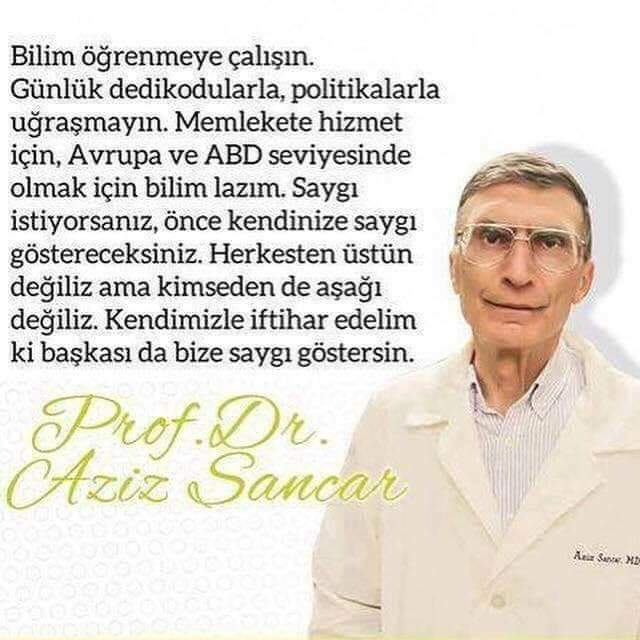

We are a part of this planet. It doesn't matter where do you live, without science, you keep staying in same history. If you would like to cut a day-sheet away from the calendar, each time you would need to study more and more. As everybody knows, no pain no gain. But another important point that you should get ahead by following a strategic way to reach good results from your effort. Here we have two matter to contribute to your society:

* study more
* find a strategic way to reach effective results

<table align='left' style="width:500px; margin-right:0px">
  <tr>
    <td></td>
  </tr>
  <tr>
    <td>Aziz Sancar, 2018</td>
  </tr>
</table>

<!--
Science
======

Blogs
-----
http://www.huseyincavus.com.tr

-->
